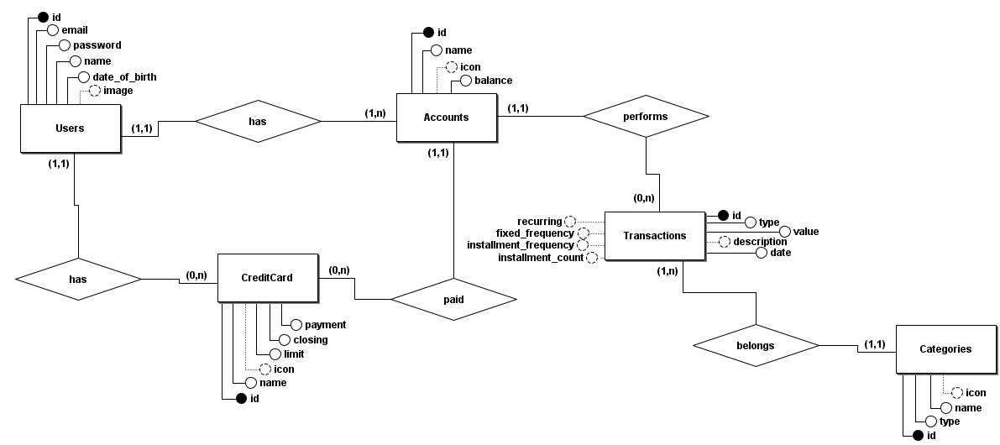

# FinTrack - Sistema de Gerenciamento Financeiro

Este é um sistema de gerenciamento financeiro desenvolvido em Java com conexão a um banco de dados PostgreSQL. O projeto permite o controle de contas, cartões de crédito, transações, orçamentos e relatórios financeiros, facilitando a organização e o planejamento financeiro dos usuários.

## Requisitos

### Requisitos funcionais

- [x] O sistema deve permitir que novos usuários se cadastrem;
- [x] O sistema deve permitir que os usuários façam login e logout;
- [x] O sistema deve permitir que os usuários criem, editem e excluam contas (ex: conta corrente, poupança, etc);
- [x] O sistema deve permitir que os usuários registrem receitas e despesas;
- [x] O sistema deve permitir que os usuários categorizem transações (ex: alimentação, transporte, lazer);
- [x] O sistema deve gerar relatórios de receitas e despesas por período;
- [x] O sistema deve exibir gráficos e tabelas de desempenho financeiro;
- [x] O sistema deve enviar notificações para o usuário sobre transações pendentes ou alertas de limite de conta;

### Requisitos não funcionais

- [x] O sistema deve ser capaz de processar 100 transações em menos de 2 segundos;
- [x] O sistema deve ser capaz de suportar até 10.000 usuários simultâneos;
- [x] O sistema deve possuir uma interface intuitiva e amigável, permitindo que novos usuários se familiarizem rapidamente;
- [x] O sistema deve criptografar os dados do usuário e utilizar autenticação segura;
- [x] O código deve ser modular e documentado para facilitar a manutenção e atualização do sistema;

### Regras de negócio

- [x] O usuário não pode registrar uma despesa maior que o saldo disponível da conta;
- [x] Cada transação deve ser categorizada em uma das categorias predefinidas;
- [x] O sistema deve manter um histórico de transações por pelo menos 12 meses;
- [x] Apenas usuários autenticados podem registrar transações e acessar relatórios financeiros;

## Funcionalidades

- **Usuários**: Cadastro e autenticação de usuários.
- **Contas**: Gerenciamento de contas bancárias com saldo e transações.
- **Cartão de Crédito**: Gerenciamento de cartões de crédito com limites e transações.
- **Transações**: Registro de transações financeiras categorizadas.
- **Orçamento**: Criação de orçamentos com categorias e monitoramento do gasto em relação ao valor total do orçamento.
- **Relatórios**: Geração de relatórios mensais e anuais das transações.

## Banco de Dados

O sistema utiliza PostgreSQL como banco de dados relacional. O arquivo `schema.sql`, localizado na pasta `docs`, cria as tabelas necessárias com todas as constraints definidas, como chaves primárias e estrangeiras, e índices. O banco de dados é nomeado como `projeto`.

### Estrutura do Banco de Dados

As tabelas principais incluem:

- **User**: Armazena informações dos usuários, como `id`, `email`, `password`.
- **Account**: Representa as contas dos usuários, incluindo `id`, `balance`, etc.
- **CreditCard**: Representa os cartões de crédito dos usuários, incluindo `id`, `limit`, `closing`.
- **Transaction**: Contém informações sobre as transações, como `id`, `amount`, `type`, `date`.
- **Category**: Define as categorias de transações financeiras.

### Diagrama ER

## Tecnologias Utilizadas

- Java: Linguagem de programação principal.
- PostgreSQL: Banco de dados relacional.
- JUnit: Framework para testes unitários.
- JFrame: Utilizado para criação de Janelas.
- Maven: Gerenciador de dependências.
